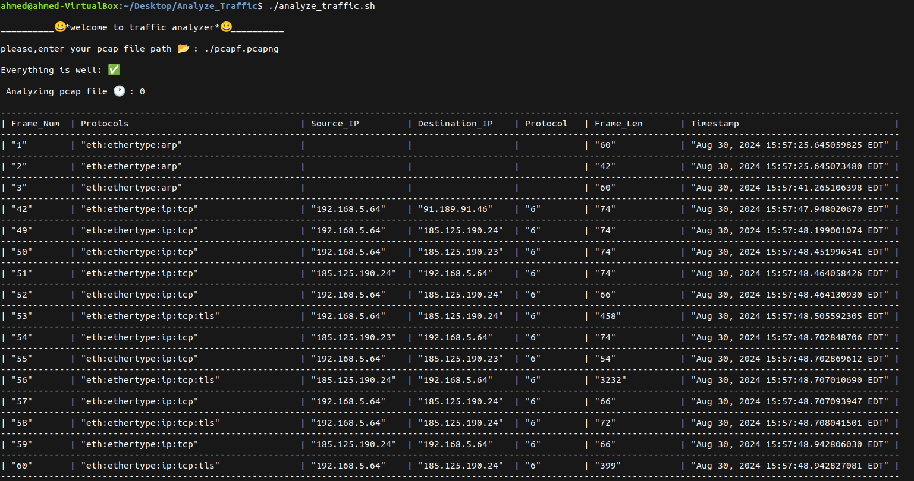

# Network Traffic Analyzer 🚀

## Overview

analyze_traffic.sh is a Bash script designed to analyze network traffic from packet capture (PCAP) files using tshark, the command-line version of Wireshark. It extracts and summarizes key statistics about network traffic, including packet counts, protocol details, and more. This tool is ideal for network administrators, analysts, or anyone interested in examining network traffic data.

## Features

    Total Packet Count: Displays the total number of packets in the PCAP file.
    Protocol List: Shows a list of unique protocols detected.
    Packet Count per Protocol: Provides a breakdown of packet counts for each protocol.
    Customizable Display: Formats and displays results in a user-friendly tabular format.

## Requirements

    Operating System: Linux, Windows, or macOS
    Dependencies:
        tshark (part of the Wireshark suite)
        awk, grep, sed, and other common Unix utilities

## Installation

    Install tshark:
        Linux: `sudo apt-get install tshark` (Debian/Ubuntu) or `sudo yum install wireshark` (Red Hat/CentOS)
        Windows: Download and install Wireshark from wireshark.org. Ensure tshark is selected during installation.
        macOS: Install via Homebrew with brew install wireshark

    Download the Script: Clone or download the script from the repository:

    git clone https://github.com/ahmedhussein18102002/Network-Traffic-Analyzer.git

Make the Script Executable:

bash

    chmod +x analyze_traffic.sh

## Usage

Run the script by : ./analyze_traffic.sh

## Screenshots

## License

This project is licensed under the MIT License. See the LICENSE file for details.

## Contact

For questions or additional information, contact Ahmed Hussein at [ahmedhusseineldalaly@gmail.com].
